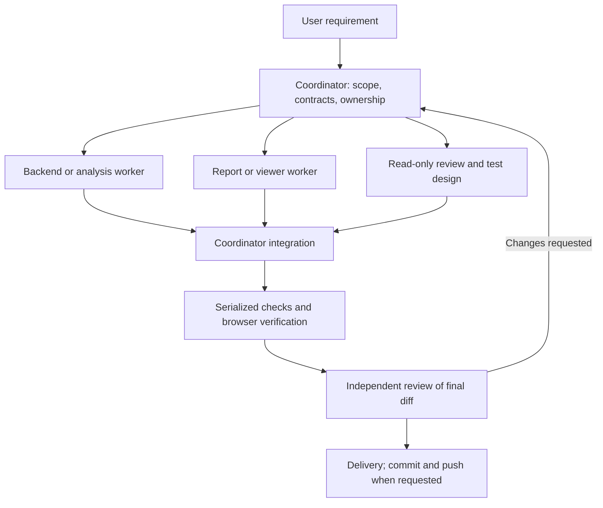

# Multi-agent development architecture

## Scope and execution

This framework organizes development of zstdf. It does not add agents to the
STDF runtime, require an API key, or replace the Rust workspace. The coordinator
uses the host's available subagent tools to execute task contracts. Markdown
files do not start agents, enforce filesystem isolation or create background jobs.
If delegation is unavailable, the coordinator follows the workflow sequentially.

In the current desktop session, one coordinator and up to three workers can run
concurrently. This is a session limit, not a permanent product guarantee. Inherit
the configured model unless the user explicitly requests a different one.

The design follows the separation of independent tasks and coordinator synthesis
described in [OpenAI's multi-agent documentation](https://developers.openai.com/api/docs/guides/responses-multi-agent).
No API example or external orchestration service is installed here.



## Roles and current module boundaries

Roles are assignments, not permanent processes. Use only those needed per task.
The table identifies candidate ownership; the task contract narrows it to exact
files. Different roles must not claim an overlapping path in the same wave.

| Role | Candidate scope | Key responsibility |
| --- | --- | --- |
| Coordinator | Cross-module contracts, root manifests, release, shared docs | Decompose, assign, resolve conflicts, integrate and report evidence |
| Decoder/validation | `stdf-core/`, `stdf-io/`, `stdf-validate/`, `stdf-ascii/` | Binary framing, field semantics, CP/FT sanity, vendor decoding |
| Storage/backend | `stdf-arrow/`, `stdf-parquet/`, viewer `ingest.rs`, `store.rs`, `query.rs` | Schemas, provenance, streaming, bounded queries and cache compatibility |
| Analysis | `stdf-analytics/`, assigned CLI analytics modules | Identity, latest attempts, traceability, statistical definitions |
| Frontend | Assigned report code, viewer `workspace.js` and `workspace.html` | Linked panes, axes, legends, accessibility and offline parity |
| Verification/reviewer | Read-only production files; explicitly assigned test files if needed | Adversarial fixtures, independent expected results, regressions and review |

`stdf-cli/src/viewer/mod.rs`, `tests.rs`, `web.rs`, shared report translations,
`Cargo.toml`, `Cargo.lock`, README and generated demo directories are common
collision points. Assign one owner or schedule sequential handoffs. Reviewer
test changes require a separate writing assignment; review itself stays read-only.
The active Cargo workspace lists nine root crates; the similarly named `crates/`
directory is not listed as a member and must not be chosen by name alone.

## Per-feature workflow

1. **Scope:** inspect status; preserve existing changes; identify affected command,
   policies, fixtures and user-visible behavior. Record what is out of scope.
2. **Contract:** coordinator fills [task.md](task.md), then pins shared request/
   response fields, null semantics, ordering, quotas, cache version and examples.
   Backend and frontend start dependent edits only after this contract agrees.
3. **Assign:** coordinator maintains the ownership table in the task document.
   Send each worker its role instructions, exact paths and expected deliverable.
4. **Implement:** run independent assignments concurrently. A blocked worker
   reports evidence and needed input; it does not invent dependent interfaces.
5. **Handoff:** worker fills [handoff.md](handoff.md). Coordinator checks the diff
   against assigned paths and requests fixes or accepts it for integration.
6. **Verify:** serialize shared builds and demos. Run focused checks first, then
   integration checks justified by the change. Record commands, exit codes and
   log paths. Stop dependent steps after failures and fix their cause.
7. **Review:** a reviewer inspects the integrated diff and evidence using
   [review.md](review.md). Re-review affected areas after fixes. Open findings
   need a fix or a documented disposition before the coordinator marks done.
8. **Deliver:** summarize behavior, checks and limitations. Only the coordinator
   commits/pushes when authorized. Reviewers do not auto-merge their own findings.

Task states: `planned -> ready -> running -> review -> verified -> delivered`.
When no independent reviewer is available, the implementation may be handed to
the user with review pending; the review gate remains unverified. Self-review is
useful but does not replace an independent agent or human review.
Use `blocked` with a concrete dependency and resume condition; rejected review
returns to `running`. After interruption, inspect actual files/processes before
resuming. Do not infer completion from a stale task state.

Store transient task contracts, logs and handoffs under
`target/agent-work/<feature>/`; durable design decisions belong in `docs/`.
The coordinator is the sole writer of task state. Workers send handoffs through
the host communication tools or write their separately assigned handoff files.

## Checkout and resource isolation

For this shared desktop checkout, use disjoint file ownership. These agents see
each other's edits immediately; a branch does not isolate their working files.
Never run concurrent formatters over all Rust files while workers are editing.

When changes need the same files, serialize them or use separate managed Git
worktrees when supported and authorized. Assign separate build/cache/demo paths,
stop each worker before integration, and review/cherry-pick its explicit changes.
Worktrees reduce edit conflicts but do not resolve incompatible interfaces.
Do not create another checkout merely because `zstdf1` exists nearby.

The coordinator grants one shared-tool slot for Cargo, demo regeneration and
browser suites. Browser suites may start a release CLI service; close only the
service they own before rebuilding its executable on Windows. Temporary logs
must have unique names. No automatic agent spawning, credential changes, cloud
uploads or changes to personal Codex configuration are part of this framework.

## Verification matrix

Commands below run from the repository root. Python 3.11+, Rust, and (for browser
checks) Node, Playwright and Edge must be available. Browser scripts document
their fixture prerequisites. Substitute the available Python executable if
`python` is not on PATH; do not install dependencies silently to obtain a pass.

| Change | Required evidence |
| --- | --- |
| Documentation/agent instructions only | Links, paths, commands and ownership consistency reviewed; no product build required |
| Parser/sanity | Targeted crate tests; malformed/truncated, endian and optional-record fixtures |
| Identity/population/provenance | Synthetic multisite/retest/duplicate/missing fixtures with hand-computed expected outcomes |
| Storage/query | Schema compatibility, quotas, cancellation, atomic output and exact source mapping tests |
| Viewer/reports | Relevant browser smoke suite, screenshot inspection, live/offline behavior and themes/languages affected |
| Integrated Rust delivery | Formatting; workspace tests excluding extension linkage; Python binding check; release CLI build |

```powershell
cargo fmt --all -- --check
cargo test --workspace --exclude stdf-py
cargo check -p stdf-py
python scripts/check_licenses.py
cargo build --release -p stdf-cli
```

For a viewer change, after the release build:

```powershell
python examples/viewer/generate_demo.py
node scripts/smoke_viewer.cjs
node scripts/smoke_viewer_axes.cjs
```

Other existing suites include `smoke_sanity.cjs`, `smoke_sanity_csv.cjs`,
`smoke_traceability.cjs`, `smoke_latest_pareto.cjs`, `smoke_ftr_patterns.cjs`
and `smoke_report_ui.cjs`. Read each header and fixture generator before use.
Large-file/performance claims require measured time, peak memory, scratch usage
and workload dimensions, not just a successful small fixture.

The existing GitHub CI remains unchanged and currently runs
`cargo test --workspace`, including the Python crate. Local exclusion of extension
linkage tests is not proof that CI passed. Report CI and local checks separately.

## Example: another wafer-map enhancement

Coordinator defines the bin metadata shape and expected treatment of missing
descriptions. Backend owns `ingest.rs` and `mod.rs`; frontend owns `workspace.js`
and translations. A read-only reviewer checks bin/run/site ambiguity and proposes
fixtures. Backend owns the Rust fixture changes in `tests.rs` during this wave.
After implementation workers finish, the reviewer can receive a separate task to
extend `smoke_viewer_axes.cjs`. Coordinator runs tests and generates the demos;
reviewer examines both the final diff and rendered legends.

The user has selected this framework as the default for future zstdf development.
An ordinary feature or fix request is sufficient: the coordinator may delegate
independent tasks without asking again for delegation permission. Small or strongly
dependent tasks may stay with one agent. Task-specific user instructions override
this default; unrelated background work, external messages, commits and publication
still require their own authorization.


## Bounded recursive improvement

For iterative optimization, use [the experiment runner and workflow](improvement.md).
The coordinator freezes evaluation criteria and controls each round. Implementation,
evaluation and independent review retain separate ownership. The runner records
acceptance/rejection evidence; it does not generate patches, spawn agents or publish.
